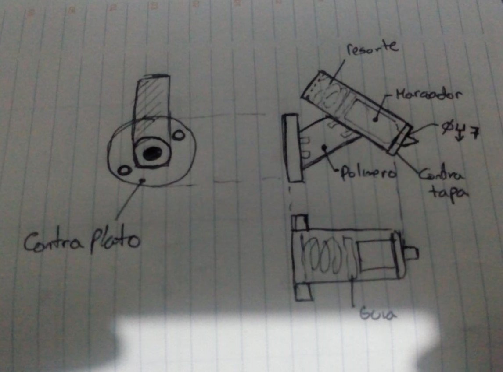
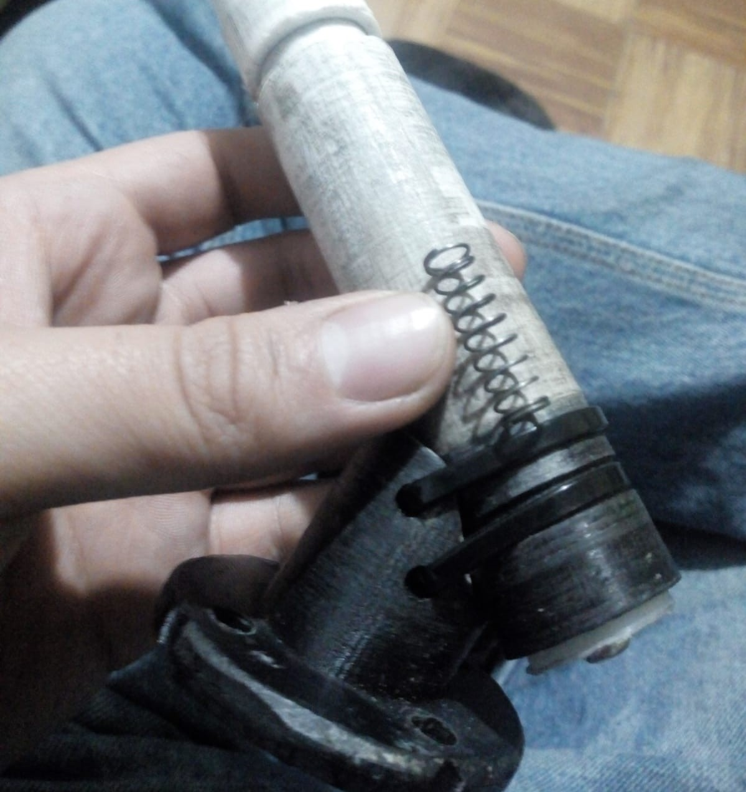

# HERRAMIENTA

## Boceto
Se plantea la forma de la herramienta con un ángulo de inclinación por dos razónes:
  - Imitar la configuración en que escribe una mano humana.
  - Evitar que el marcador sea colinear al eje normal a la cara plana del plato (singularidades).

## Resorte
Con el resorte se busca regular pasivamente la fuerza aplicada sobre la superficie, con esto se logra:
  - Un trazo más suave.
  - Evitar dañar el brazo y la herramienta.

