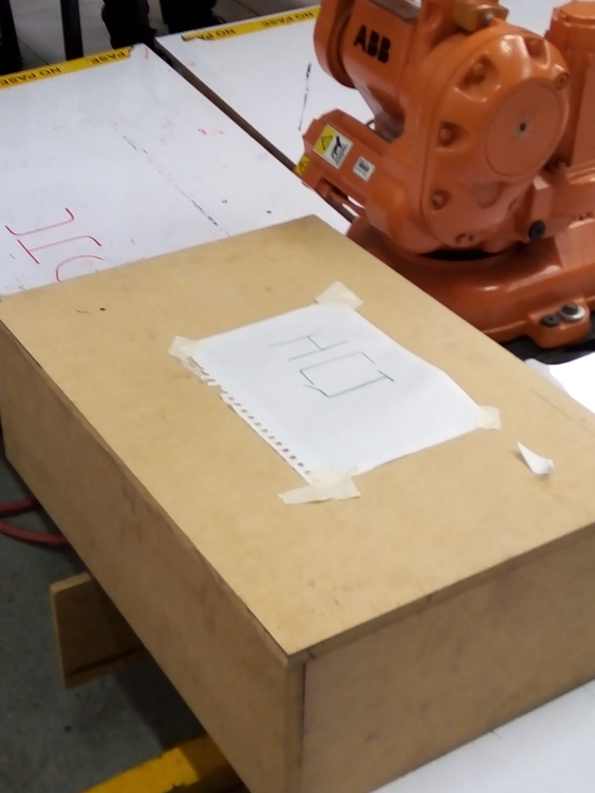

# Laborarorio 1 - Robótica Industrial No.1

### Equipo (Grupo de laboratorio Viernes 2-4PM)
- Christian Camilo Cuestas Ibáñez
- José Daniel Suárez Vásquez
- Daniel Vargas

## Diseño de herramienta

## Descripción de solución planteada

### Resultado

[comment]: <> (Insertar link al video 'PrimeraEscritura.mp4' ubicado en la carpeta multimedia del repositorio)

